## 💮 Hi! I'm Lavinia 💮

- **Age**: 22
- **Nationality**: Brazilian | Korean 
- Graduated in **Systems Development** from FIAP
- Junior developer focused on building full-stack applications and improving through hands-on projects

## Languages and Tools

- **Languages:** Java, C#
- **Frontend:** HTML5, CSS3, JavaScript
- **Backend:** ASP.NET Core, Spring Boot
- **Database:** Oracle SQL 
- **Tools & Others:** Azure, VS Code, Insomnia, IntelliJ

## Contact Info

  

